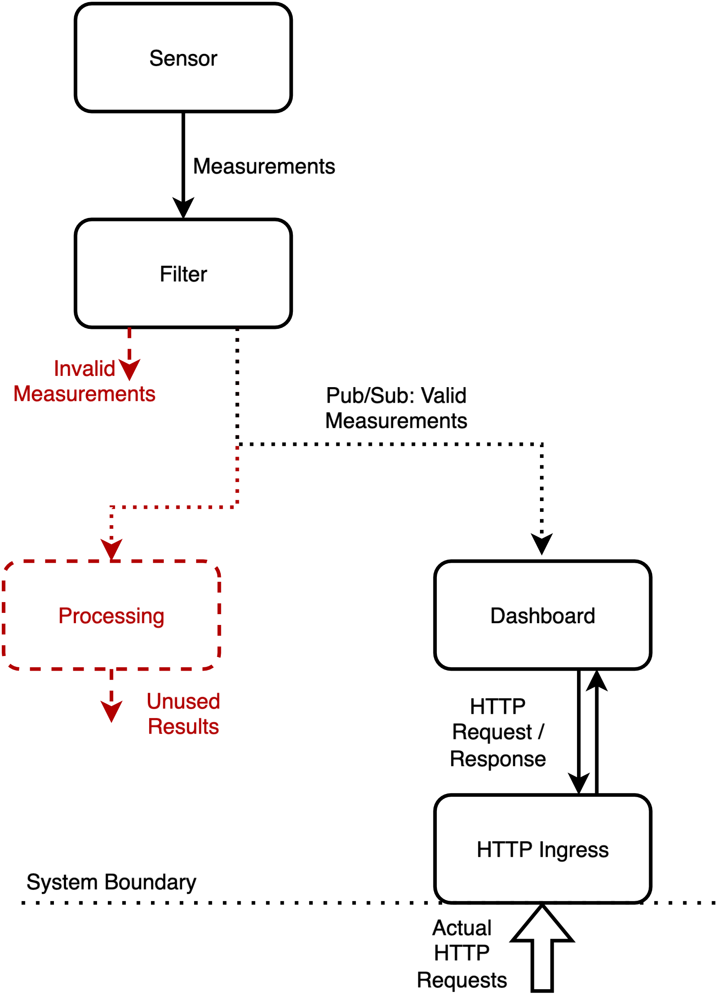

# Nextless: Compiler-Inspired Serverless

This repository contains a research prototype of Nextless, a "next-generation" serverless platform for edge computing scenarios.

Nextless relies on
* *compiler-inspired transformations and optimizations* in the orchestration system (orchestration-time abstractions),
* the integration of *resources such as sensors and actuators*,
* and the use of *lightweight runtimes*,

to enable the efficient execution of complex serverless applications on sets of heterogeneous and potentially resource-constrained edge devices.

Nextless is a research fork of the [EDGELESS reference implementation](https://github.com/edgeless-project/edgeless).

The system is in an early work-in-progress state and should not be used for anything beyond experimentation.  
The system does not contain any security features and should only be used in fully trusted networks.

## Overview

Nextless executes *Applications* comprising *Actors* and *Resources*.

Actors represent stateful but side-effect-free services defined by untrusted developers.  
Due to their untrusted nature, they are executed in an isolated way using suitable isolation techniques, e.g., process VMs. 

Resources are included in the implementation of the worker nodes and can only be configured and instantiated.  
They are executed without any sandbox and are thereby able to cause external effects and may be triggered by external effects.

Both Actors and Resources define a set of input and output *Ports*.  
Those are mapped together in the *Application Description*, enabling the reuse of Actors across applications.

Both the Actor's logic (Behavior [1]) as well as the Interactions between Ports can be defined using a set of formats called *Dialects* [2].  
The platform's orchestration system can convert between these dialects.

The conversion of the Actor's logic allows the system to efficiently target heterogeneous worker nodes, e.g., using platform-specific native images.

The conversion of Interactions enabled the developers to use abstractions that are then efficiently mapped to the available links.  
As an example, the developers may use pub/sub, which is then automatically converted to IP Multicast.

In addition to the conversions, the system can use the holistic view provided by the application description for optimizations.  
As an example, it can use static analysis to detect and remove unused links, actors, and parts of the actors before they are deployed onto the worker nodes.

In addition to the static optimizations, the system also tracks the runtime performance of the actor instances and uses this knowledge for adaptive optimizations.

[1]: Term inspired by the Actor model.  
[2]: Term inspired by MLIR.

## Further Documentation

You can find the discussion of an example application below.

* [Qickstart Guide](./documentation/quickstart.md)
* [Installation](./documentation/installation.md)
* [Actor Reference](./documentation/building_actors.md)
* [Application Reference](./documentation/building_applications.md)
* [System Overview](./documentation/system_components.md)
* [Controller (containing the Compiler-Inspired Aspects)](./edgeless_con/README.md)

## Example



The figure above shows an example Application.
Its code can be found in [examples/demo_sensor_dashboard/demo.star](examples/demo_sensor_dashboard/demo.star).

It consists of

* the *Sensor* Actor producing mocked sensor values,
* the *Filter* Actor that filters those sensor values and forwards them to one of two output ports depending on whether their value is below a threshold,
* the *Dashboard* Actor that collects the last 10 values and makes them available to an HTTP API,   
* the *Processing* Actor that performs some mocked calculations on the values before forwarding them, and
* a *HTTP Ingress* Resource that enabled the Dashboard's API to be reachable using actual HTTP requests.

The Resource is required as Actors, such as the Dashboard, aren't allowed to directly cause any side effects and therefore are unable to directly listen for HTTP requests.

In the example, the Processor's output is ignored, which renders its execution useless.  
Transitively, this also renders the event going from the Filter to the Processor useless.  
The system should detect this and elide the deployment of the Processor.

Actors are defined using a Starlark-based abstract definition:

```star
DemoFilter = edgeless_actor_class(
    id = "demo_filter",
    version = "0.1",
    outputs = [
        cast_output("accepted_out", "eft.eval.mock_sensor_value"),
        cast_output("rejected_out", "eft.eval.mock_sensor_value")
    ],
    inputs = [
        cast_input("data_in", "eft.eval.mock_sensor_value")
    ],
    inner_structure = [link("data_in", ["accepted_out", "rejected_out"])],
    code = file("demo_filter.tar.gz"),
    code_type = "RUST_NO_STD"
)

el_main = DemoFilter
```

This definition defines the Actor's Ports (including their semantics and type), its inner structure, which is required to remove unnecessary interactions, and links to the Actor's Behavior.

In the example, the Actor's Behavior is defined using Rust (the full version can be found [here](functions/demo_filter/src/lib.rs)):

```rust
#![no_std]

use edgeless_function::*;

struct DemoFilter;

edgeless_function::generate!(DemoFilter);

impl DemoFilterAPI<'_> for DemoFilter {
    type EFT_EVAL_MOCK_SENSOR_VALUE = edgeless_function_types::eval::MockSensorValue;

    fn handle_cast_data_in(_src: InstanceId, measurement: Self::EFT_EVAL_MOCK_SENSOR_VALUE) {
        log::info!("Received data: value: {}", measurement.value);
        if measurement.value <= 25.0 {
            cast_accepted_out(&measurement);
        } else {
            cast_rejected_out(&measurement);
        }
    }

    ...
}
```

Our framework generates a trait from a JSON representation of the abstract definition presented above.
The developers need to implement this trait to define the Behavior of their Actor.

While implementing this trait, the developers need to map the abstract types to a Rust type implementing our framework's serialization and deserialization traits and implement handlers for the incoming ports,e.g., `handle_cast_data_in`.
They can use generated functions for sending data to output ports, e.g., `cast_accepted_out`.

To learn more about building Actors, please refer to [documentation/building_actors.md](documentation/building_actors.md).

The set of Actors/Resources constituting an application is defined in an Application Specification:

```star
load("../../functions/demo_sensor/demo_sensor.star", "DemoSensor")
...

sensor = edgeless_actor(...)

filter = edgeless_actor(
    id = "filter",
    klass = DemoFilter,
    annotations = {},
)

ingress = edgeless_resource(
    id = "demo_ingress",
    klass = HTTPIngress,
    configurations = {
        "host": "demo.localhost",
        "methods": "GET"
    }
)

processor = edgeless_actor(...)

sensor.value >> filter.data_in
ingress.new_request >> dashboard.http_fetch
filter.accepted_out >> topic("valid_measurements")
dashboard.data_in << topic("valid_measurements")
# Useless Interaction
processor.data_in << topic("valid_measurements")

wf = edgeless_workflow(
    "sensor_dashboard_demo",
    [sensor, filter, dashboard, ingress, processor],
    annotations = {}
)

el_main = wf

```

This specification defines logical instances of Actors and Resources (which also require configuration).
Furthermore, it defines Interactions between the actors.

In the example, the Sensor is directly linked to the Filter [3],
while the Filter's output and the Dashboard's input are mapped together using an abstract topic that is resolved in the orchestration system.

To learn more about building Applications, please refer to [documentation/building_applications.md](documentation/building_applications.md).

[3]: The arrow syntax has been inspired by Apache Airflow.

## Repository Structure

This repository mostly consists of folders representing Rust crates (`edgeless_*`).

### System Components

The main system components (cf. [documentation/system_components.md](documentation/system_components.md)) can be found in the following folders/crates:

* `edgeless_con` houses the controller implementing the compiler-inspired aspects of the project.
* `edgeless_cli` provides the CLI tool to build actors and interact with the controller.
* `edgeless_node` houses the implementation of the worker node. 

### Actors, Applications, and Resources

The repository contains a set of example applications that can be deployed to a Nextless cluster.  
The applications and their components can be found in the following folders:

* `functions` contains the set of Rust-based example actors included with this repository.
* `resources` provides the descriptions of the resources included with the (embedded) worker node.
* `examples` contains the example applications using those actors and resources.

### Inter-Component APIs

There is a set of crates that define the APIs enabling the components to interact.

* `edgeless_api` provides the main APIs used for the interaction between the main system components. 
  * It also defines shared types used across the components.
* `egeless_api_core` represents the parts of the APIs usable by the `#![no_std]` embedded efforts.

### Actor-related APIs

These crates define the APIs used to implement Rust-based actors.  
They enable those actors to interact with the worker node.

* `edgeless_function` represents the main crate used by every function.
  * It uses the procmacro-crate `edgeless_function_macro` to provide the `edgeless_function::generate!()` macro.
* `edgeless_function_types` contains shared type definitions for messages sent between actors.
* `edgeless_function_gpu` provides the actor-side implementation of our wgpu-based GPU support.
* `edgeless_actor_abi` represents the ABI used between the native actors and the native runtime.

### Helper Crates

* `edgeless_build` provides the functionality used to build images (Wasm and native) from Rust-based actors.
  * It is used by `edgeless_cli` and `edgeless_con`.
  * It relies on a nightly Rust compiler.
* `edgeless_config` defines the Starlark-based description of actors and applications.

### Embedded Efforts

This repository also contains an experimental port of the worker node to microcontroller-based devices.

* `edgeless_embedded` represents the core of the embedded effort and contains the device-independent implementation of the embedded worker node.
* `edgeless_embedded_esp32` contains the esp32(-s3) specific wrapper of the core `edgeless_embedded` and the device-specific sensor/actuator implementation.
* `edgeless_embedded_emu` contains a wrapper of the core `edgeless_embedded` that can be executed on Linux-based nodes (it relies on `embassy-net-tuntap`).

## Naming Inconsistencies

EDGELESS and earlier versions of this project call *Applications* *Workflows*.
We have renamed this as our applications are different from workflows in other systems.
This renaming effort is not yet complete, and the code, as well as some commands (e.g., edgeless_cli workflow start), still use the old name.

EDGELESS and earlier versions of this project call *Actors* *Functions*.
We have started to rename this to Actors as this better reflects their functionality.
This renaming effort is not yet complete, and the code, as well as some commands (e.g., edgeless_cli function start), still use the old name.

## License

The Repository is licensed under the MIT License. Please refer to
[LICENSE](LICENSE) and the copyright headers in each file. 

## Funding & Heritage
This project started as a fork of the [EDGELESS Reference Implementation](https://github.com/edgeless-project/edgeless)
and is developed as part of the EDGELESS Project.

The fork's main focus and differentiating factor is the integration of compiler-inspired transformations, which also require a more well-defined application model.

The fork's initial focus lies on independent and locally-aggregated clusters of devices, with support for multi-cluster deployments and cloud backends deferred for later.
Compared to the EDGELESS reference implementation, Nextless simplifies the control plane by merging the controller and orchestrator, and
will rely on the federation of controllers and the deployment of sub-applications to span multiple clusters.


EDGELESS received funding from the [European Health and Digital Executive Agency
 (HADEA)](https://hadea.ec.europa.eu/) program under Grant Agreement No 101092950.


